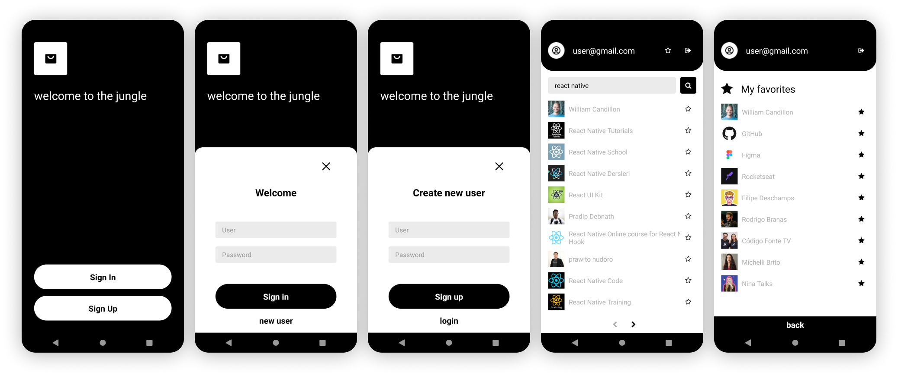

# FavTube



Aplicação React Native que atende às seguintes funcionalidades:

- [x] Cadastro de usuário;
- [x] Login;
- [x] Logout;
- [x] Pesquisa de canais do youtube;
- [x] Salvar canais nos favoritos;
- [x] Listar canais favoritados;

## Por onde começar

Essas instruções irão lhe mostrar como realizar uma cópia desse projeto e rodá-lo localmente em ambiente de desenvolvimento.

### Pré-requisitos

- [Chave de API do Google](https://developers.google.com/youtube/v3/getting-started?hl=pt_br) para realizar as requisições ao Youtube Search API;

- [Ambiente React Native](https://react-native.rocketseat.dev/) com build para Android;

### Instalação

Clone o repositório:

```
git clone https://github.com/luisabfs/favtube.git
```

Inicialize a pasta `node_modules`:

```
yarn install
```

Crie um arquivo chamado `.env` na raíz do projeto e adicione a sua chave de API:

```env
API_KEY=SUACHAVEDEAPI
```

Inicie a aplicação React Native e execute o build no Android:

```
yarn start
yarn android
```

## Construído com

* [RealmDB](https://realm.io/docs/javascript/latest/) - banco de dados open-source utilizado em aplicações mobile offline-first;
* [Axios](https://github.com/axios/axios) - cliente HTTP baseado em Promises para realizar requisições;
* [React Navigation](https://reactnavigation.org/docs/getting-started) - navegação e gerenciamento de rotas;
* [Styled Components](https://rometools.github.io/rome/) - biblioteca que permite estilização a nível de componente (CSS-in-JS);
* [PropTypes](https://github.com/facebook/prop-types) - checagem de tipos (Typechecking);

## Licença

Este projeto é licenciado pela MIT License - cheque o arquivo [LICENSE.md](LICENSE.md) para maiores detalhes.
